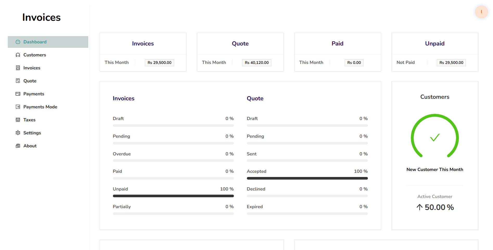
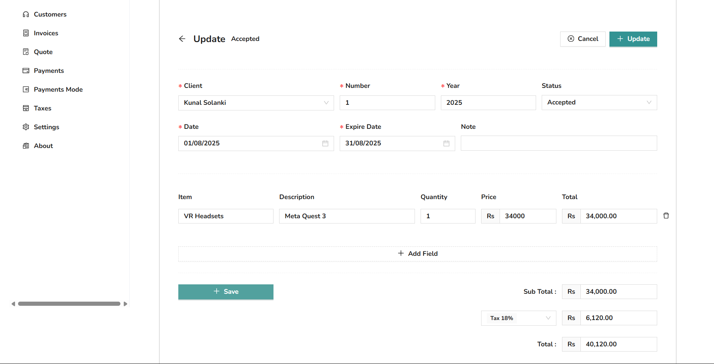
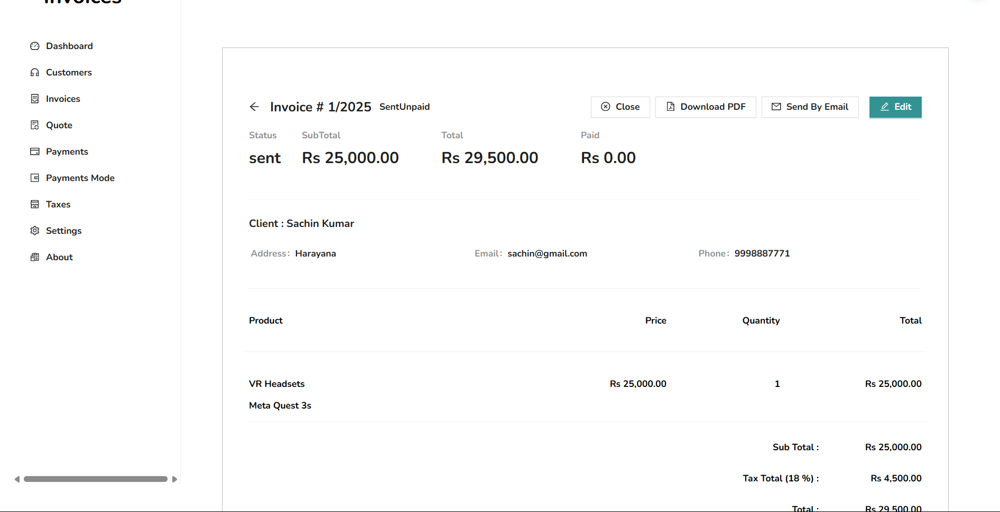
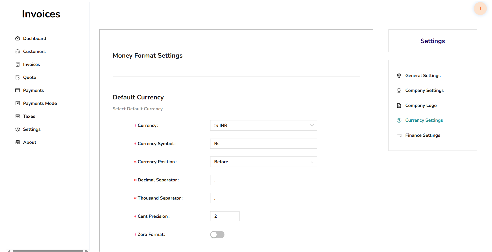
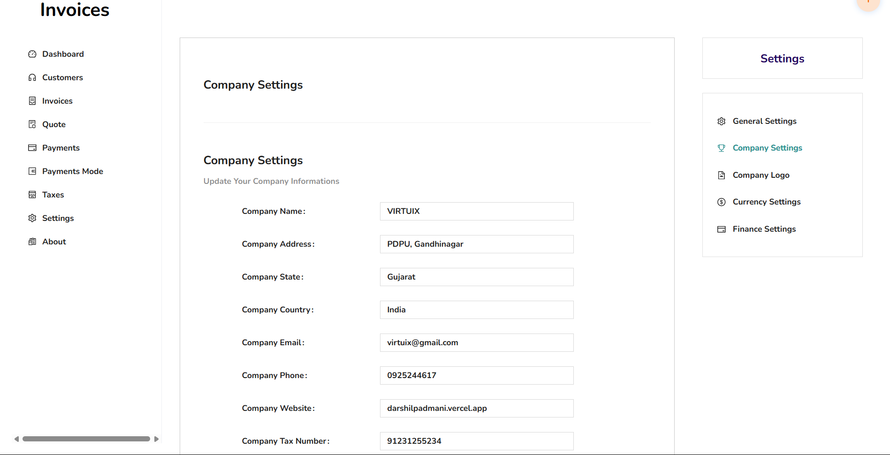

# Invoice Management System

A comprehensive invoice management system built with the MERN stack, featuring modern UI components and efficient business operations management.

## 🚀 Features

### 📄 Invoice Management
- Create, edit, and manage invoices
- Generate PDF invoices
- Track invoice status and payments


*Invoice management dashboard*

### 📋 Quote Management
- Create and send professional quotes
- Convert quotes to invoices
- Quote approval workflow


*Quote creation and management*

### 👥 Customer Management
- Comprehensive customer database
- Customer profile management
- Communication history


*Customer management interface*

## 🛠️ Technology Stack

- **Frontend:** React.js with Ant Design Framework 🐜
- **Backend:** Node.js / Express.js
- **Database:** MongoDB
- **Architecture:** MERN Stack 👨‍💻

## 📸 Screenshots

### Dashboard Overview

*Main application dashboard*

### Other Settings Interface



*Complete application interface*

## 🏃‍♂️ Getting Started

### Prerequisites
- Node.js (v14 or higher)
- MongoDB
- npm or yarn

### Installation

1. Clone the repository
```bash
git clone <repository-url>
cd invoices
```

2. Install backend dependencies
```bash
cd backend
npm install
```

3. Install frontend dependencies
```bash
cd ../frontend
npm install
```

4. Set up environment variables
```bash
cp backend/.env.example backend/.env
# Edit the .env file with your configuration
```

5. Start the development servers
```bash
# Backend (from backend directory)
npm run dev

# Frontend (from frontend directory)
npm start
```

## 📁 Project Structure

```
invoices/
├── backend/           # Express.js API server
├── frontend/          # React.js application
├── screenshots/       # Project screenshots
└── README.md
```

## 🤝 Contributing

1. Fork the project
2. Create your feature branch (`git checkout -b feature/AmazingFeature`)
3. Commit your changes (`git commit -m 'Add some AmazingFeature'`)
4. Push to the branch (`git push origin feature/AmazingFeature`)
5. Open a Pull Request

## 📝 License

This project is licensed under the MIT License - see the [LICENSE](LICENSE) file for details.

## 📞 Contact

Your Name - your.email@example.com

Project Link: [https://github.com/yourusername/invoices](https://github.com/yourusername/invoices)

